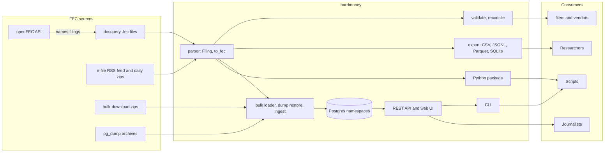

# hardmoney

[](https://github.com/cgorski/hardmoney/actions/workflows/ci.yml)
[](https://crates.io/crates/hardmoney)
[](https://docs.rs/hardmoney)
[](https://cgorski.github.io/hardmoney/)

hardmoney reads, writes, checks, and loads U.S. federal campaign-finance
data. It is a Rust library, a command-line tool, and a Python package.

FEC data enters on the left, passes through the crate's modules, and
reaches people through the API, exports, the CLI, and Python:



It parses every FEC electronic filing format since 2001, writes filings
back out, validates them against the FEC's own acceptance rules, checks a
report's cover-page totals against its schedules, loads the FEC's bulk
downloads into Postgres, and serves them over a REST API. Money is an
exact decimal everywhere; nothing is ever a float.

The [hardmoney Book](https://cgorski.github.io/hardmoney/) has tutorials
for people who have never seen an FEC file and a reference for people who
have.

## Python

Most people who work with FEC data work in Python, so the whole parser,
writer, validator, and reconciler are on PyPI as `hardmoney`, with typed
stubs and no Python dependencies. Wheels are published for Linux
(x86_64, aarch64) and macOS (Intel, Apple silicon), Python 3.9 and newer;
other platforms build from the source distribution, which needs a Rust
toolchain.

```bash
pip install hardmoney
```

```python
import hardmoney

filing = hardmoney.parse_file("F3XA_2011827.fec")
print(filing.form_type, filing.version, len(filing.lines))

for line in filing.lines_for("SchA"):
    print(line["contributor_last_name"], line.amount("contribution_amount"))  # decimal.Decimal

report = filing.validate()          # the FEC's rules; report.errors, report.warnings
recon = filing.reconcile()          # cover page vs. schedules, to the cent
print(recon.balances, [c.line for c in recon.mismatches()])

filing.summary.set("committee_name", "Corrected Name PAC")
open("fixed.fec", "wb").write(filing.to_fec())
```

The package is the same Rust code with typed stubs and no Python
dependencies, so it drops into a Django or pandas workflow as is. Every
class, method, and function carries a docstring, so `help(hardmoney.Filing)`
at the prompt shows the same text as the reference.

The Python documentation is its own part of the book:

- [Getting started with Python](https://cgorski.github.io/hardmoney/python.html):
  install, a first script, the mental model, how to find field names,
  error handling.
- [Python cookbook](https://cgorski.github.io/hardmoney/python-cookbook.html):
  thirty-five runnable scripts with their output, from top donors to a
  pre-submission check.
- [Python API reference](https://cgorski.github.io/hardmoney/python-api.html):
  every signature and docstring, generated from the type stub.
- [For FEC staff](https://cgorski.github.io/hardmoney/for-fec-staff.html):
  Python-first workflows for reviewing incoming filings.

## How it compares

Facts below were checked against each project's source in September 2026.

| | hardmoney | [fecfile](https://github.com/esonderegger/fecfile) (Python) | [FastFEC](https://github.com/washingtonpost/FastFEC) (C) | [libfec](https://github.com/asg017/libfec) (Rust) | [feco3](https://github.com/NickCrews/feco3) (Rust/Python) | [FECfile+](https://github.com/fecgov/fecfile-web-api) (the FEC's filing tool) |
|---|---|---|---|---|---|---|
| Spec versions parsed | 3.x–8.5 (2001–present) | 3.x–8.5 | 3.x–8.5 | 8.0+ (~2018–present) | 8.x | 8.5 only |
| Money type | exact decimal | float | double | string | f64 | decimal |
| Writes `.fec` files | yes, round-trip exact | no | no | no | no | yes (5 form types) |
| Validates against FEC rules | yes, 32 rules; checked against the FEC's WebCheck | no | field-count warnings | no | no | no (users are told to run WebCheck separately) |
| Cover page vs. schedules | F3X, F3, F3P, incl. allocation schedules H3–H6 | no | no | no | no | F3X only, five lines stubbed to zero; F3 computed as all zeros |
| Compile-time-checked field access | yes (`Field<T>`) | – | – | no | no | – |
| Machine-readable spec, version diff | yes (`spec export`, `spec diff`) | no | no | no | no | no |
| Streaming large filings | yes (9.8 MB RSS on a 135 MB file) | yes | yes | yes | yes | – |
| Export to CSV / Parquet / SQLite | CSV, JSON Lines, Parquet, SQLite | dicts | CSV | SQLite, CSV, JSON, Excel | CSV, Parquet | – |
| Filing discovery via openFEC, latest amendment only | yes | no | no | yes | no | – |
| Amendment-chain resolution in a database | yes | no | no | no | no | – |
| Live e-file feed and daily-zip backfill | yes | no | no | no | no | – |
| Bulk downloads into Postgres | 10 files, transactional reload, namespaces | no | no | partial | no | – |
| REST API over the loaded data | yes | no | no | no | no | – |
| Python package | yes | yes | yes | yes | yes | – |

"–" means the row does not apply to that project.

Two things no other open-source tool does: check that a report's cover
page agrees with its itemized schedules, and check a filing against the
FEC's acceptance rules before it is submitted. Both are what the FEC's
Reports Analysis Division does by hand on every report it receives.

## What you get

**Parser.** Every FEC electronic spec, 3.x through 8.5, including Form 1
and Form 2 registrations, F3Z consolidated reports, and Schedule I. Field
values come back as filed, trimmed and nothing else. Strict parsing fails
on the first unreadable line and says which; lenient parsing skips it and
tells you. `Filing::open` streams a 135 MB presidential filing in under
10 MB of memory.

**Schema as data.** The column positions for every spec version and the
FEC's field specifications (type, length, required level, rule text) are
compiled into the crate from `data/`. Generated constants such as
`sch_a::CONTRIBUTION_AMOUNT` carry their table in the type, so asking an
F3X cover page for a Schedule A field does not compile. `hardmoney spec`
exports the whole thing as JSON or diffs two versions.

**Writer.** `Filing::to_fec` is the inverse of parsing. Change a field
with `ParsedLine::set`, write the filing back, and it re-parses
field-for-field identical. This holds for every fixture and for 144 of 144
parseable real filings in the test corpus.

**Validator.** `hardmoney validate` applies the FEC's acceptance rules:
required fields, types and lengths, real dates, amount formats, ID
formats, the legal character set, unique transaction IDs, resolvable
back-references. One finding per line, exit code 1 if the FEC would reject
the file. Across 102 filings the FEC accepted, it reports zero errors.
`--oracle webcheck` submits the file to the FEC's own WebCheck service and
diffs the two reports.

**Reconciler.** `hardmoney reconcile` recomputes every cover-page line of
a Form 3X, 3, or 3P from its schedules and formulas. Memo entries are
excluded and the $200 itemization threshold is respected, so lines that may
carry unitemized amounts are checked as floors. On the FEC's own test data
it agrees with FECfile+ on every line FECfile+ computes, and it computes
the allocation lines FECfile+ leaves at zero. Of 109 real reports, 95
balance exactly; the rest have genuine discrepancies.

**Discovery and feed.** `hardmoney filings --committee C… --most-recent`
lists a committee's filings through openFEC and can fetch, validate,
reconcile, or ingest each one. `hardmoney efile watch` follows the FEC's
RSS feed; `efile backfill` walks the daily zip archives back to 2001.

**Export.** `hardmoney export` writes one table per schedule as CSV, JSON
Lines, Parquet (amounts as `Decimal128`, dates as `Date32`), or SQLite.

**Postgres ETL.** All ten FEC bulk files, streamed into `COPY`. Reloading a
cycle deletes and reinserts in one transaction, so the table matches the
FEC's weekly file exactly, deletions included. Namespaces keep cycles,
snapshots, or investigations apart in one database. Ingested filings get
their amendment chains resolved (`most_recent`, `amendment_chain`) the way
openFEC reports them.

**REST API and `query`.** Candidates, committees, itemized contributions
and disbursements, independent expenditures, filings. API keys, CORS
allow-lists, timeouts, trigram search. `hardmoney query` runs the same
routes from the terminal without a server.

## Install

```bash
cargo install hardmoney            # CLI
pip install hardmoney              # Python package (https://pypi.org/project/hardmoney/)
```

```toml
# Rust library, parser only (no Postgres, Axum, or Tokio):
hardmoney = { version = "3", default-features = false, features = ["fetch"] }
```

Rust 1.94 or newer. Postgres 18 for the ETL and API.

## Sixty-second tour

Load one cycle's candidates and committees, then search:

```bash
export DATABASE_URL=postgres://user@localhost/fec

hardmoney schema-init --schema cycle_2026
hardmoney bulk-load candidates --cycle 2026 --schema cycle_2026
hardmoney bulk-load committees --cycle 2026 --schema cycle_2026
hardmoney bulk-load schedule_a --cycle 2026 --schema cycle_2026 --limit 200000  # drop --limit for all 2.2 GB
hardmoney serve --schema cycle_2026 --api-key my-secret &

hardmoney query candidates -q cooper --cycle 2026 --schema cycle_2026
hardmoney query contributions --committee C00913566 --min-amount 1000 --schema cycle_2026
```

Run the same `bulk-load` next week and it replaces that cycle's rows in
one transaction, or does nothing if the FEC's file has not changed
(`--if-changed`).

One filing, no database:

```bash
hardmoney parse filing.fec --lenient        # JSON summary, with any skipped lines and why
hardmoney validate filing.fec               # the FEC's acceptance rules
hardmoney reconcile filing.fec              # cover page vs. schedules
hardmoney write --check filing.fec          # does it round-trip?
hardmoney export filing.fec --format parquet --out out/
hardmoney spec fields SchA --version 6.4    # where each Schedule A field was in spec 6.4
hardmoney spec diff 7.0 8.5                 # what moved between two versions
```

Rust, fetching a filing and summing its contributions:

```rust
use hardmoney::parser::tables::{f3x, markers::F3X};
use hardmoney::{Filing, ScheduleA, Table};
use rust_decimal::Decimal;

fn main() -> Result<(), Box<dyn std::error::Error>> {
    let filing = Filing::fetch(2011831)?;
    println!("{} spec {} ({} lines)", filing.raw_form_type, filing.version, filing.lines.len());

    // Only F3X fields are accepted for an F3X cover page; anything else is a compile error.
    if let Ok(cover) = filing.summary_as::<F3X>() {
        println!("receipts this period: {:?}", cover.money(f3x::COL_A_TOTAL_RECEIPTS));
    }

    for line in filing.lines_for(Table::SchA).take(3) {
        println!("line {}: {:?}", line.line_no, line.get("contributor_last_name"));
    }

    let itemized: Decimal = filing
        .views::<ScheduleA>()
        .filter_map(|a| a.contribution_amount)
        .sum();
    println!("itemized Schedule A: ${itemized}");
    Ok(())
}
```

[`examples/`](./examples/) has four runnable programs. The
[Book](https://cgorski.github.io/hardmoney/) has the tutorials and the CLI
and REST references.

## Development

```bash
cargo test --all-features                                   # no database needed
HARDMONEY_TEST_DATABASE_URL=postgres://user@localhost/t cargo test --all-features   # with Postgres
cargo clippy --all-features --all-targets -- -D warnings
cd python && maturin develop --release && pytest             # Python package
```

[`CONTRIBUTING.md`](./CONTRIBUTING.md) lists the rules every change is
held to: no panics in library code, types instead of conventions, facts
about the format in `data/` rather than in Rust, and docs that match the
code.

CI runs fmt, clippy, rustdoc with warnings denied, an MSRV build, the test
suite against Postgres 18, `cargo package`, and a weekly job that
re-derives the bundled FEC field specification from the FEC's current
sources and fails if it has drifted.

## License and provenance

`Apache-2.0 OR BSD-3-Clause`. See [`LICENSE-APACHE`](./LICENSE-APACHE),
[`LICENSE-BSD`](./LICENSE-BSD), and [`NOTICE`](./NOTICE).

Column-position tables derive from
[`dwillis/fech-sources`](https://github.com/dwillis/fech-sources) (Apache-2.0),
with the corrections listed in `NOTICE`; `F2S.csv` is authored here. The
field specifications are distilled from the FEC's own Electronic Filing
Specification workbook, a public-domain U.S. government work. Test fixtures
are real filings from the FEC's document store.
