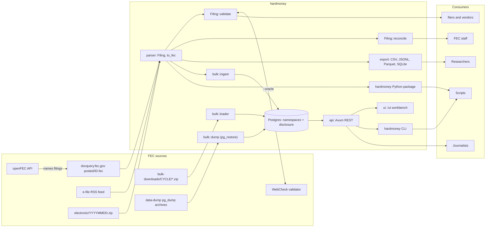
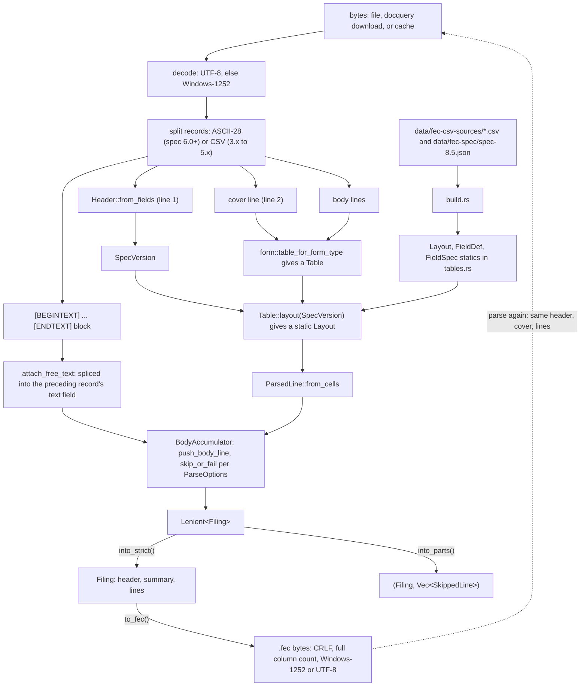
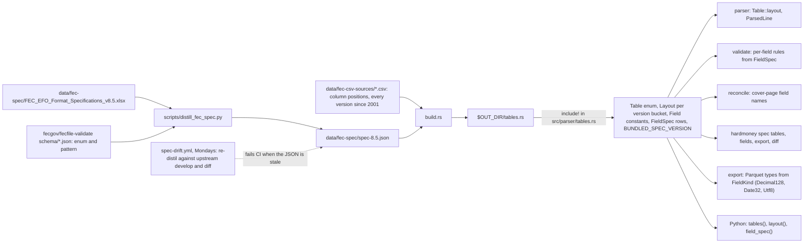
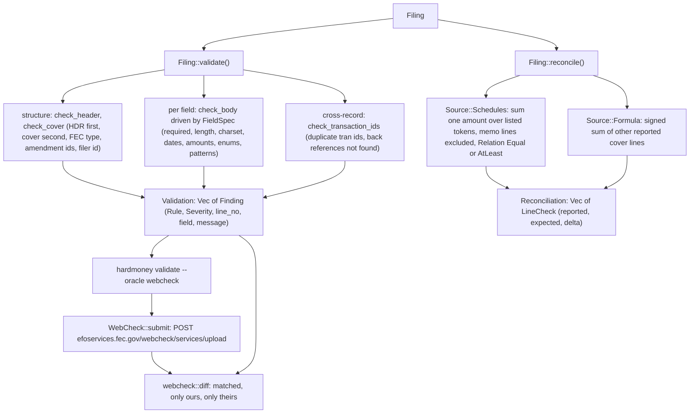
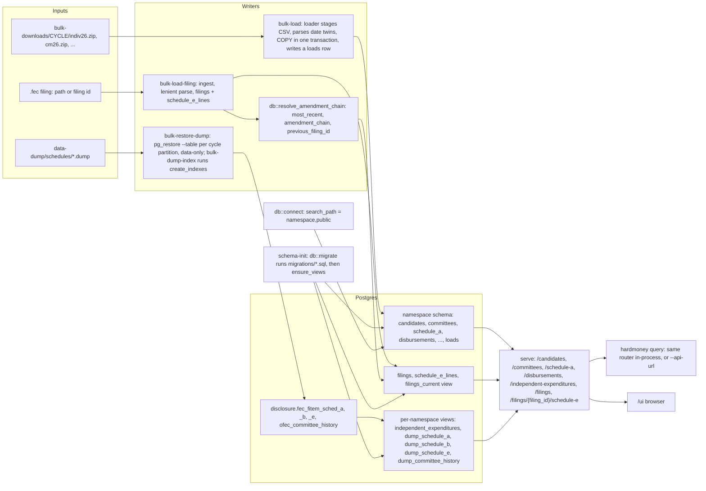
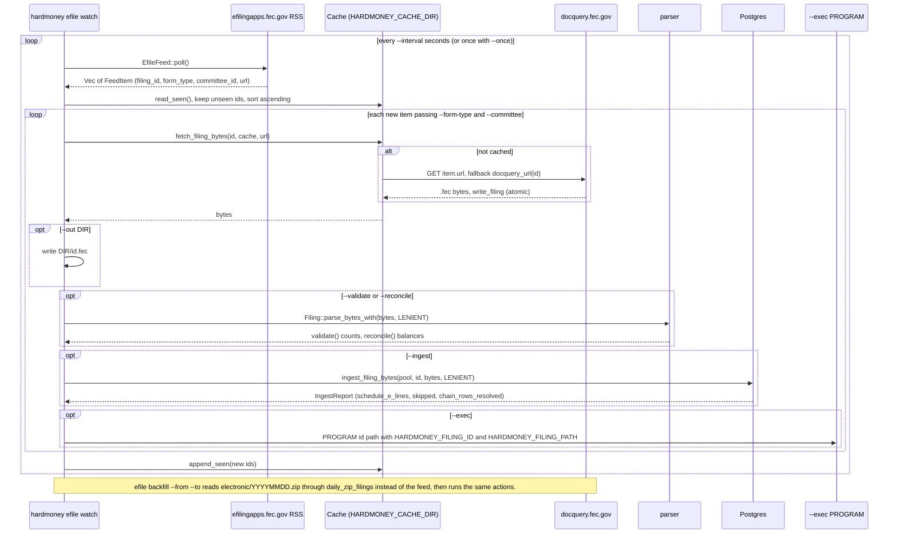
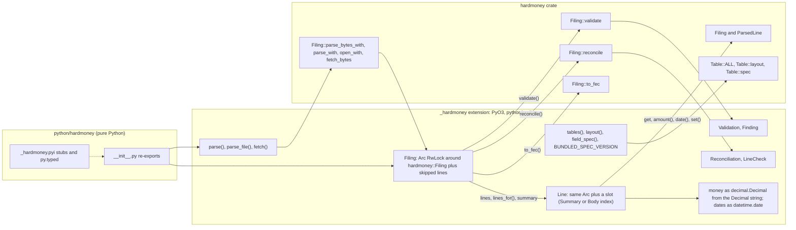

# How data flows through hardmoney

This chapter is a map. Each diagram names the real types, functions,
commands, and tables involved, so you can go from a box to the code
(`src/`) or to the chapter that explains it. Read it once before the
tutorials, or come back to it when you want to know where a particular
piece of FEC data enters and where it ends up.

## Overview

Every box on the left is an FEC endpoint: six supply bytes or rows, and
WebCheck receives a filing and returns the FEC's own findings.
Everything in the middle is a module of the crate (`src/parser`,
`src/fec`, `src/export`, `src/bulk`, `src/db`, `src/api`, `src/ui`,
`src/cli`, and the PyO3 crate in `python/`). Individual filings flow
through the parser and out to the validator, reconciler, exporter, or
Postgres ingester; the FEC's aggregated products (bulk zips and `pg_dump`
archives) bypass the parser and go straight into Postgres.

### Where each kind of FEC data enters and which command handles it

| Source (URL pattern) | Command | Table or output |
|---|---|---|
| `docquery.fec.gov/dcdev/posted/<id>.fec` | `parse`, `validate`, `reconcile`, `write`, `export` (a file); `bulk-load-filing <id>` and `Filing::fetch` download it | `Filing` in memory; `filings` + `schedule_e_lines` when ingested |
| `efilingapps.fec.gov/rss/generate?preDefinedFilingType=ALL` | `efile watch` | cache (`~/.cache/hardmoney/filings/<id>.fec`), then `--validate`, `--reconcile`, `--ingest`, `--out`, `--exec` |
| `fec.gov/files/bulk-downloads/electronic/YYYYMMDD.zip` | `efile backfill --from --to` | same actions as `efile watch`, one archive per day |
| `api.open.fec.gov/v1/filings/` and `/efile/filings/` | `filings --committee ... --fetch/--validate/--reconcile/--ingest` | filing metadata, then the same per-filing actions |
| `fec.gov/files/bulk-downloads/<cycle>/{cn,cm,ccl,indiv,oth,pas2,oppexp,weball,webl,webk}<yy>.zip` | `bulk-load <source> --cycle`, `bulk-load-all --cycle` | `candidates`, `committees`, `candidate_committee_links`, `schedule_a`, `committee_to_committee_transactions`, `committee_to_candidate_transactions`, `disbursements`, `candidate_summary`, `house_senate_summary`, `pac_party_summary`, plus a `loads` row |
| `fec.gov/files/bulk-downloads/data-dump/schedules/{fec_fitem_sched_a,fec_fitem_sched_b,fec_fitem_sched_e,ofec_committee_history}.dump` | `bulk-restore-dump <name> [--cycles]`, `bulk-dump-index` | `disclosure.*` tables; `independent_expenditures` and `dump_*` views in each namespace |
| `efoservices.fec.gov/webcheck/services/upload` | `validate --oracle webcheck` | the FEC's findings, diffed against ours |
| the spec workbook and fecfile-validate schemas (build time) | `scripts/distill_fec_spec.py`, then `cargo build` | `Table`, `Layout`, `FieldSpec` statics; `spec tables/fields/export/diff` |

## A filing's life inside the parser

`Filing::parse_bytes` decodes once for the whole file, reads the header
and cover line, and then runs every body line through the same two
lookups: the form-type token in column 0 picks a `Table`, and the
filing's `SpecVersion` picks that table's `Layout`. A `ParsedLine` keeps
a reference to the layout it was parsed with, which is what lets
`Filing::to_fec` write every field back at the right column. Under
`ParseOptions::STRICT` the first unparseable body line fails the parse;
under `ParseOptions::LENIENT` it is recorded as a `SkippedLine` and the
`Lenient<Filing>` must be opened with `into_parts()` or `into_strict()`.
`FilingReader` (and `Filing::open`, built on it) follow the same steps
one record at a time for filings too large to hold in memory.

## Build-time schema pipeline

Nothing about the FEC format is hand-written in Rust. `build.rs` reads
the per-table CSVs (which column each field occupies in each spec
version) and the distilled `spec-8.5.json` (type, length, required
level, rule text, allowed values, regex per field) and emits
`$OUT_DIR/tables.rs`, which `src/parser/tables.rs` includes. The parser,
validator, reconciler, `spec` command, Parquet exporter, and Python
package all read the same statics, so a format change is a data change
followed by a rebuild. The weekly `spec-drift.yml` job re-runs the
distillation against the FEC's current fecfile-validate schemas and
fails when the checked-in JSON differs.

## Validate and reconcile

`validate()` never fails: it walks the header, cover line, and body,
applying structural rules, the per-field rules the bundled `FieldSpec`
rows describe, and the cross-line transaction-id checks, and returns a
`Validation` whose `Finding`s carry the FEC's own message wording.
`reconcile()` handles Forms 3X, 3, and 3P: each cover-page `LineRule`
is either a `Source::Schedules` sum (memo entries excluded, compared as
`Equal` or `AtLeast`) or a `Source::Formula` over other reported lines,
and each produces a `LineCheck`. With `--oracle webcheck` the CLI also
uploads the file to the FEC's WebCheck and prints the diff between the
two sets of findings.

## Postgres side

Three writers, one reader. The `loader` streams a bulk zip into a
staged CSV (adding a parsed `DATE` twin for each raw date column and the
`cycle`), then in one transaction deletes the cycle's old rows (`replace`
mode), `COPY`s the file in, and records the load in `loads`. `ingest`
parses a single `.fec` leniently, stores the header and cover as JSONB
plus the Schedule E lines as typed rows, and re-resolves the filing's
amendment chain so `filings_current` is right as soon as it commits.
`pg_restore` puts the FEC's own dumps into the fixed `disclosure` schema,
and `ensure_views` exposes them inside each namespace. Every hardmoney
table is unqualified, so `db::connect`'s `search_path` decides which
namespace a load, a migration, or a query sees. The Axum router reads all
of it; `hardmoney query` dispatches to the same router in-process, and
the browser UI calls it over HTTP.

## Live feed

`efile watch` polls the FEC's RSS feed, which lists the last seven days
of e-filings within minutes of receipt, and processes each id it has
not seen before, oldest first so amendments follow their originals. The
bytes come through `fetch_filing_bytes`, which reads the cache before
touching the network and stores each download atomically. The actions
(`Actions` in `src/cli/filings.rs`) are shared with `efile backfill` and
`hardmoney filings`, so a filing found through the daily archives or
openFEC is handled identically.

## Python

The Python package is the same Rust code behind a thin PyO3 layer. A
Python `Filing` owns the parsed `hardmoney::Filing` inside an
`Arc<RwLock<_>>`; a `Line` is a handle into that shared filing (the
cover line or a body index), so `line.set(...)` followed by
`filing.to_fec()` writes the edit through. The typed stubs in
`_hardmoney.pyi` describe the surface, and money crosses the boundary as
`decimal.Decimal` built from the exact `Decimal` string, never as a
float. The [Python](./python.md) chapter has the full surface.
